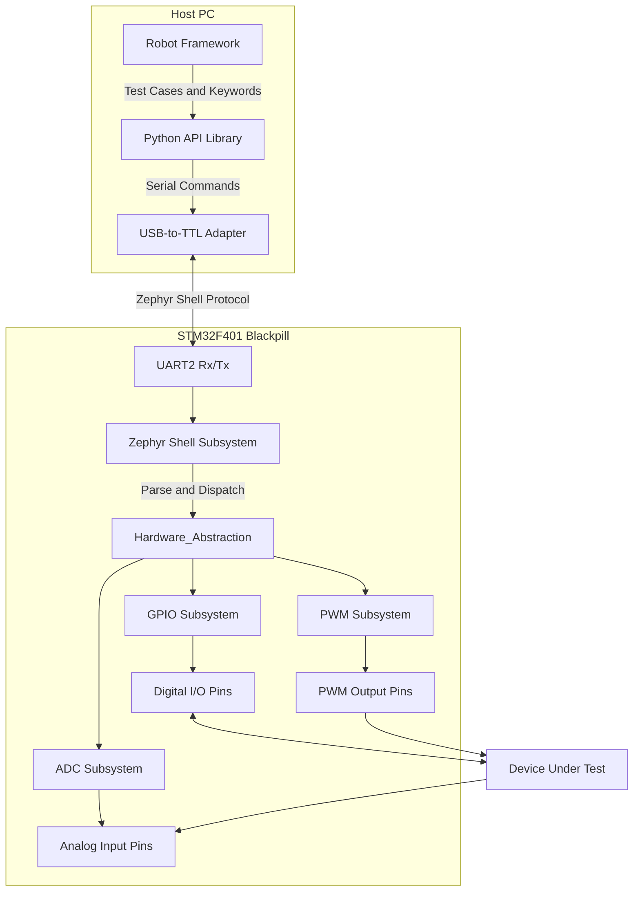

# Testbench Architecture

The Blackpill Testbench is designed with a three-layer architecture to ensure a clear separation of concerns between test definitions, host-side communication, and real-time hardware execution.

## 🏗️ High-Level Diagram

## 🧱 Layer Details

### 1. Test Automation Layer (Robot Framework) — owner: Seif
This layer sits at the top and provides the human-readable testing syntax. Test engineers write scripts using keywords provided by the custom Python library. This abstracts away the hardware communication entirely.

### 2. Host Communication Layer (Python) — owner: Seif
A Python class acting as a driver. It utilizes `pyserial` to connect to the USB-to-TTL adapter.
- **Role**: Translates Python method calls into Zephyr Shell text commands.
- **Example**: `tb.set_gpio(1, True)` translates to the serial string `"tb gpio set tb_out_1 1\r\n"`.
- **Parsing**: Reads the string responses from the Zephyr shell and parses them into Python booleans, integers, or exceptions.

### 3. Real-Time Hardware Layer (Zephyr RTOS) — owner: Mostafa
The Blackpill runs Zephyr RTOS.
- **Zephyr Shell**: We utilize the built-in Zephyr Shell subsystem. This subsystem provides a robust, interrupt-driven UART command line interface. It handles command history, autocompletion (useful for manual debugging), and argument parsing.
- **Devicetree**: We abstract the physical pins using a custom `app.overlay` file. For instance, `PA4` is aliased as `tb_out_1`. The C code interacts with `tb_out_1` rather than hardcoding `PA4`.
- **Drivers**: Zephyr's standard APIs (`gpio.h`, `pwm.h`, `adc.h`) are used to execute the physical changes with RTOS-level deterministic timing.
